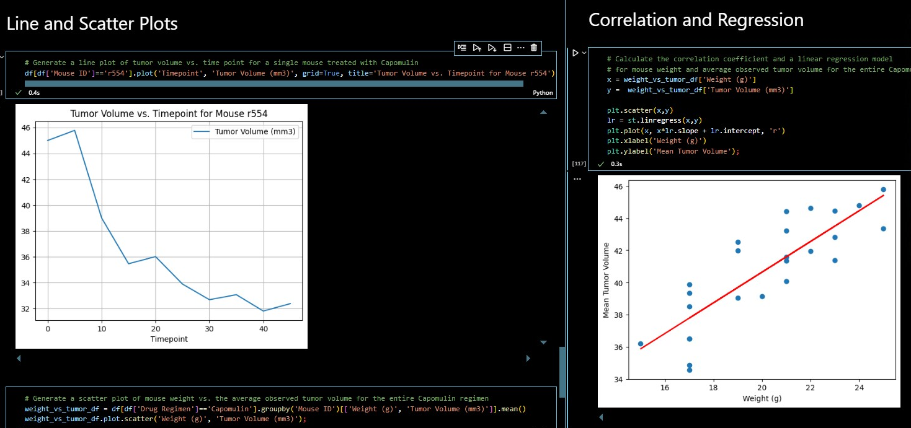

# Drug Treatment Analysis

## Website: 
[website](https://github.com/Damiomo/Drug-Analysis)

## Description
Analyze animal study result of the effectiveness of ten different drugs on squamous cell carcinoma (SCC).

## Table of Contents
- [Installation](#installation)
- [Usage](#usage)
- [Credits](#credits)
- [License](#license)
- [Features](#features)

- [Contact](#contact)

## Installation
Pandas, Matplotlib, Python, Jupyter Notebook

## Usage
Run the ipynb file on Jupyter  Notebook or VsCode

## Credits
Damilare Omoboriowo

## License
MIT

## Features
It provides bar charts, bubble charts and line graphs

## Contact
If there are any questions or concerns, I can be reached at:
##### [github: Damiomo](https://github.com/Damiomo)
##### [email: domoboriowo14@gmail.com](mailto:domoboriowo14@gmail.com)
